# Data Discovery

Data Discovery lets you ask questions about your data in plain English and get an answer backed by live lookups — schemas, query results, and documents from a connected repository. You do not need to write SQL or build a dashboard first.

Open it from **Discovery** in the left sidebar, below Workstreams.

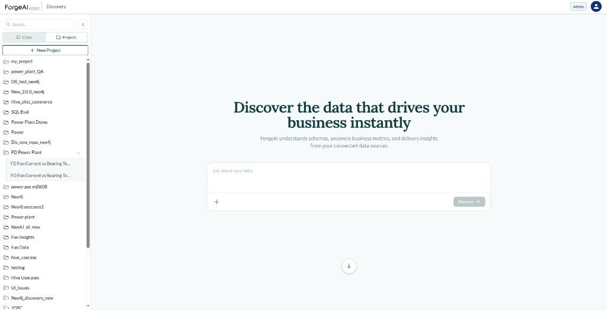

This guide covers how to organize chats and projects, how to attach data and instructions, how to ask questions, and how to manage conversations afterwards.

---

## How it works, in short

1. **Open Discovery** from the left sidebar.
2. **Pick a level** — a standalone **Chat**, or a **Project** that groups related chats.
3. **Attach configs** — Data Connections, Integrations, and Instructions. Project configs apply to every chat in that project; chat configs apply to that chat only.
4. **Ask your question** — Discovery looks up the right datasets and documents, then answers with tables, charts, and caveats.

---

## Step 1: Chats vs Projects

The left sidebar has two tabs.

| | **Chats** | **Projects** |
|---|---|---|
| **What it is** | A single standalone conversation | A dedicated space for related Discovery chats |
| **Config scope** | Whatever you attach applies to **that chat only** | Whatever you attach applies to **every chat in the project** |
| **Use it when** | You have a one-off question | You will keep coming back to the same data |

### Start a chat

On the **Chats** tab, click **+ New Chat**.

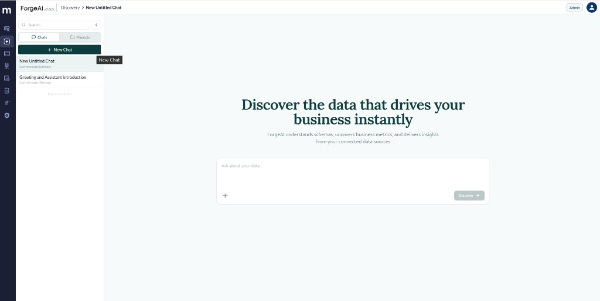

### Create a project

On the **Projects** tab, click **+ New Project**, fill in **Project Name** (required) and an optional **Description**, then click **Create**.

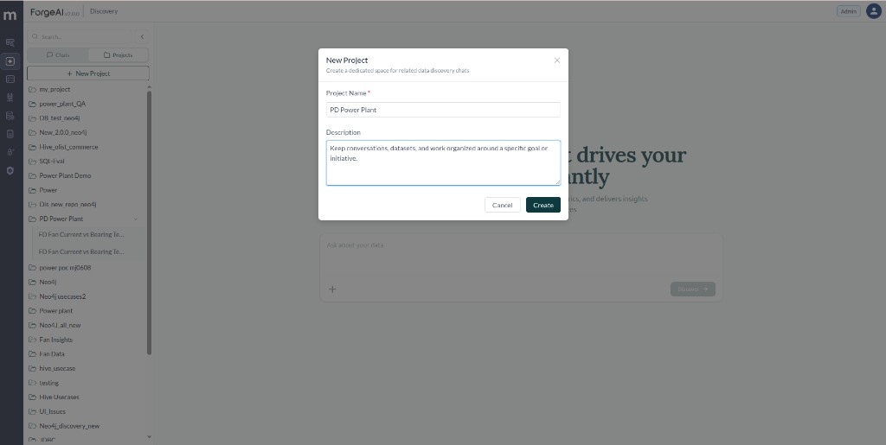

Chats you start from inside a project inherit that project's configs. You can also move an existing chat into a project later — see [Managing chats](#managing-chats).

---

## Step 2: Attach Configs

A config is what Discovery is allowed to use. There are three kinds, and both chats and projects use the same three:

| Config | What it does |
|---|---|
| **Data Connections** | Databases, warehouses, and file systems Discovery can query (JDBC, Databricks Unity Catalog, Hive / Yeedu, S3, Salesforce, Neo4j, and others) |
| **Integrations** | GitHub, Jira, Yeedu, or Databricks — so Discovery can also read repositories, tickets, and compute context |
| **Instructions** | Standing guidance for how Discovery should answer in this scope (for example, always use average metrics, always show graphs) |

### Project level

Use this when several chats should share the same data. Open the project and click **Configs** in the top right.

#### Data Connections

The **Data Connections** tab lists **Currently Linked** connections at the top and **All Connections** below. Search if the list is long, tick what this project needs, then click **Save**.

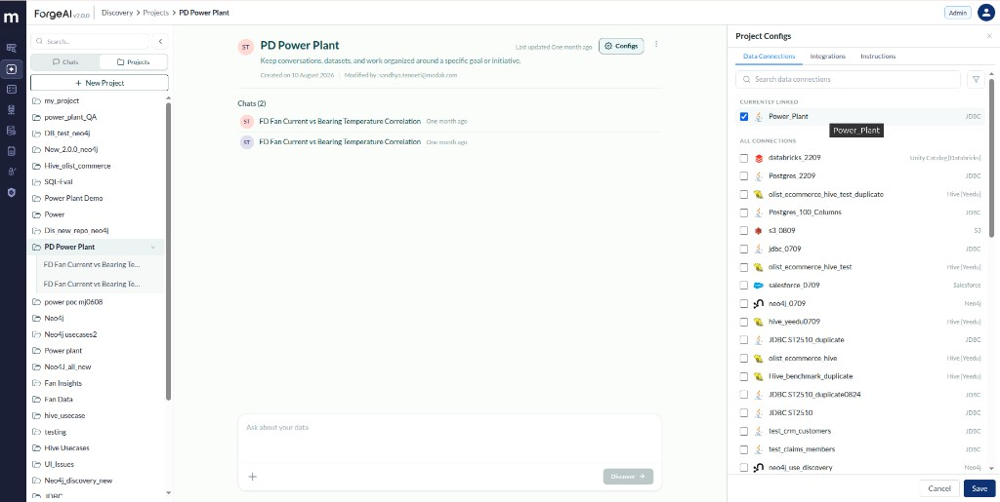

Every chat inside the project — existing and new — can now query those connections.

#### Integrations

GitHub must be connected once in **User Settings** before you can pick a repository here.

1. Open **User Settings** from the right corner.
2. Under **Configured Apps**, click **GitHub**.
3. Enter **GitHub Username** and **GitHub Token**, then **Test Connection** and **Save**.

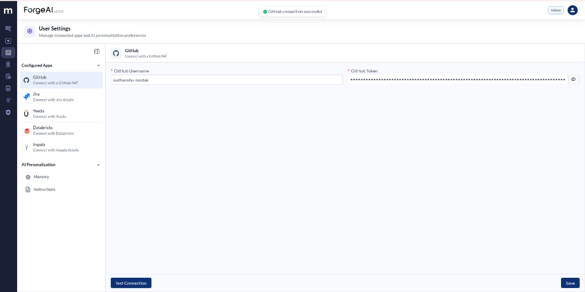

Then, in the project's **Configs → Integrations** tab:

1. Expand **GitHub** (it should show **Connected**).
2. Select the **repository** and **branch**.
3. Click **Save**.

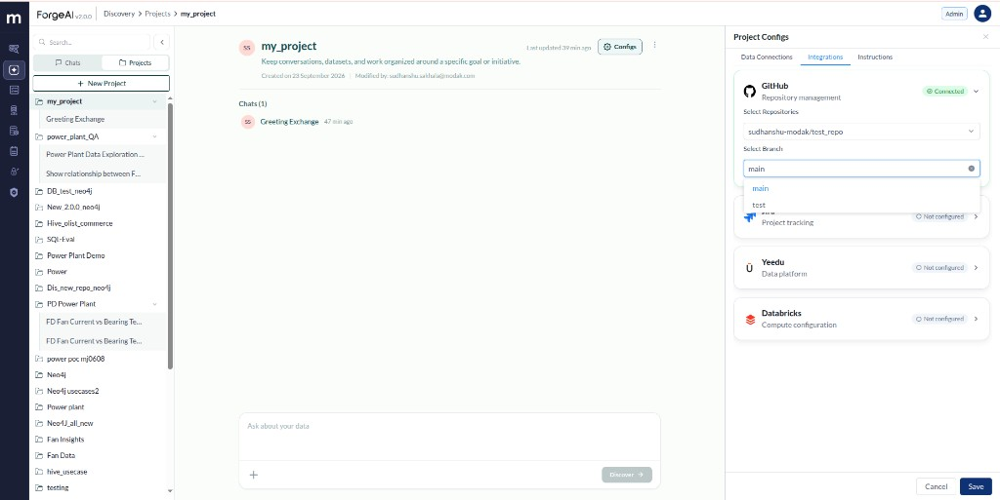

Yeedu, Databricks, and Jira appear on the same tab. Configure them only if Discovery needs those systems for this project.

#### Instructions

On **Configs → Instructions**, create standing rules for every chat in the project.

1. Add a **Name** (for example `visual rep`).
2. Add **Content** — the actual instructions, such as “always show the analytics in suitable clean graphs and use average metrics always.”
3. Click **Create**.

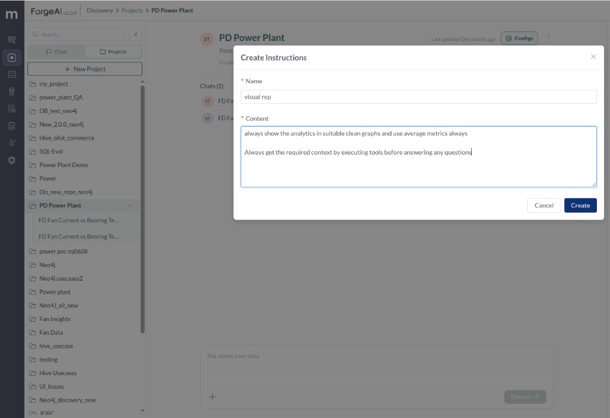

### Chat level

Use this when one conversation needs something the rest of the project does not. Click the **+** icon in the chat input and pick **Data Connections**, **Integrations**, or **Instructions**.

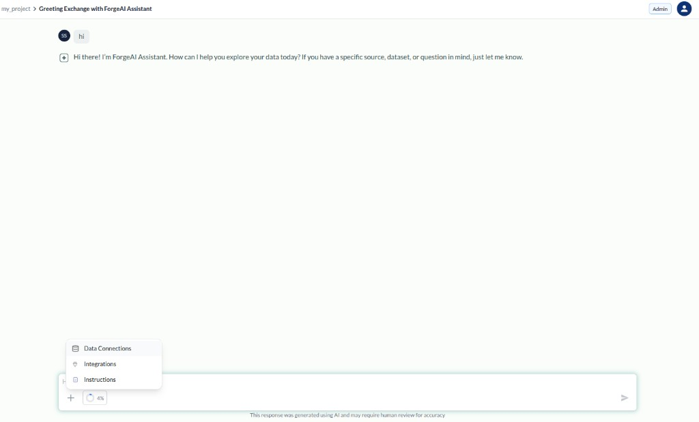

That attachment applies only to the current chat. Nothing else in the project is affected.

> If Discovery cannot see a dataset, this is almost always why — the connection is attached at chat level in a different chat, or not attached at all.

---

## Step 3: Ask Your Question

Type into **Ask about your data** and click **Discover**. Name the things you care about; Discovery finds the datasets, columns, and documents behind them.

One question can pull from a table and from a specification in the connected repository in the same turn.

**Relationships and correlations**
> "Show the relationship between FD Fan Current and FD Fan Bearing Temperature."

**Comparisons**
> "How did FD Fan Bearing Temperature differ from FD Fan Motor Bearing at drive end and non-drive end?"
>
> "Which ID Fan consumed more power at the same load?"

**Operating history**
> "For how long did ID Fan A operate at full load?"
>
> "How many PA Fans are in operation at full load?"

**Documents and specifications** (needs a GitHub integration)
> "What is the design duty of FD Fan?"
>
> "What are the applicable alarm and trip limits of ID Fan?"

**Synthesis across the conversation**
> "Based on operation parameters, can you recommend a maintenance procedure for any of the fans?"

Findings carry forward inside a chat, so keep a line of investigation in one conversation rather than starting a new one for every follow-up.

---

## What an Answer Looks Like

A typical answer includes:

- **A headline / one-sentence answer** at the top
- **The source** — connection name and ID, table, row count, and time window
- **Tables** of the numbers it actually computed
- **A chart**, when the shape of the data matters
- **Caveats** — sample size, sensor noise, confounders it tested, and anything it did *not* verify
- **A bottom line** — what the result supports, and what it does not

Expandable **tool calls** above the answer show which datasets and documents were read.

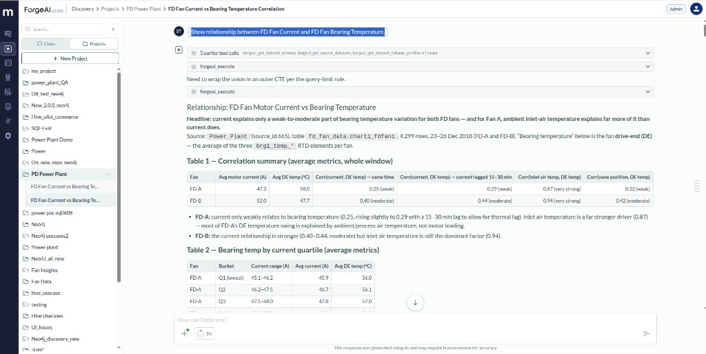

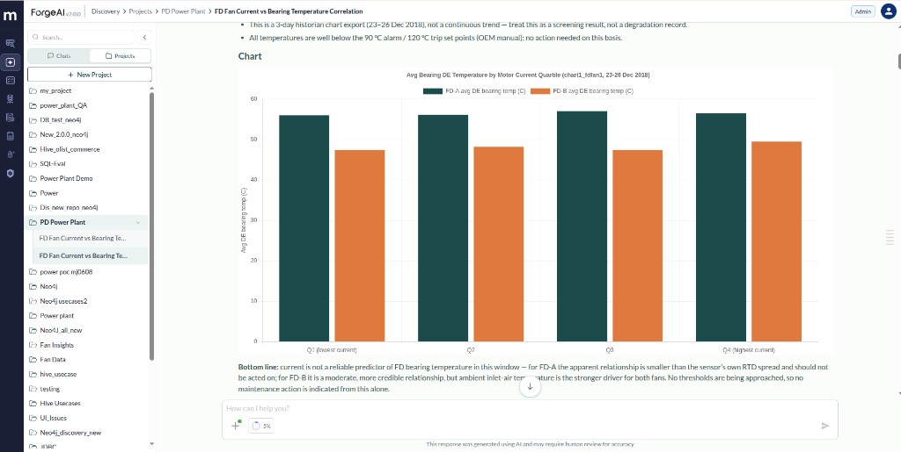

Answers are based on lookups run for **that question**. If the underlying data has changed, ask again rather than relying on an earlier reply.

---

## When Discovery Says It Cannot Answer

Discovery will refuse a question rather than invent a number. Typical cases:

- The signals you asked about never appear in the same time window, so they cannot be joined.
- A measurement does not exist in the connected data (for example, asking for kW when only current is recorded).
- A source document is internally inconsistent, so a value in it is not trustworthy.
- A reference it would need — a curve, a baseline — is not in the connected scope.

It explains what is missing, offers what it *can* provide instead, and says what would be needed for a full answer. Treat that as a signal to attach more data or fix a source, not as a failure.

---

## Managing chats

Use the **⋮** menu on a chat.

From the **Chats** tab:

| Action | What it does |
|---|---|
| **Rename** | Change the chat title |
| **Move to project** | Attach the chat to an existing project so it inherits that project's configs |
| **Delete** | Remove the chat |

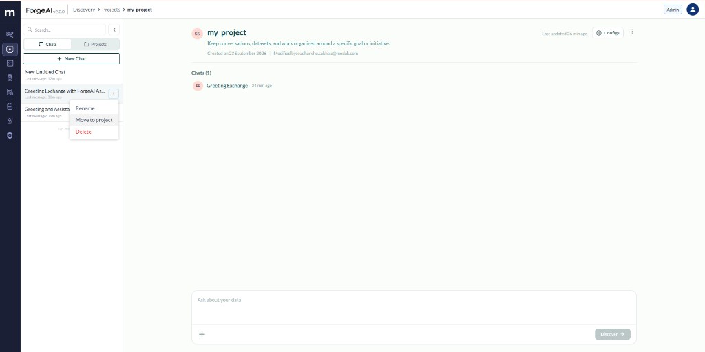

**Move to project** opens a picker. Search or select the target project, then confirm.

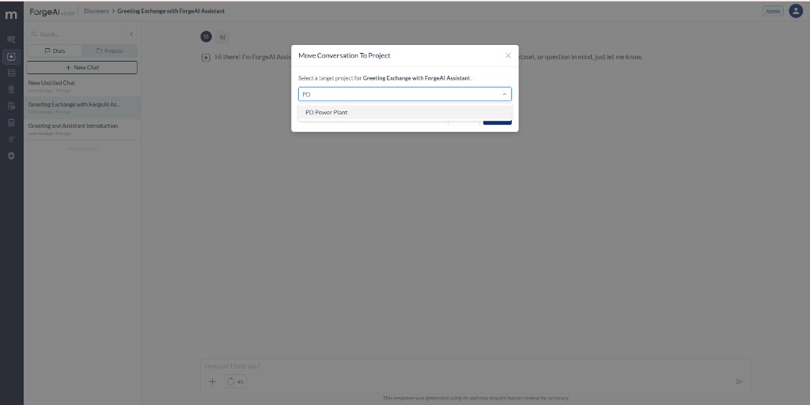

From inside a **project**:

| Action | What it does |
|---|---|
| **Rename** | Change the chat title |
| **Remove from project** | Take the chat out of the project; it becomes a standalone chat again |
| **Delete** | Remove the chat |

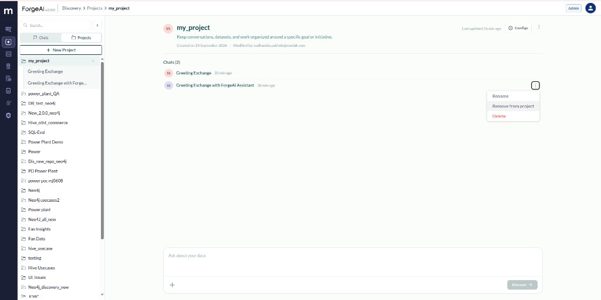

---

## Quick Troubleshooting

| Issue | What to check |
|---|---|
| Discovery cannot see a dataset | Attach the connection — **Configs** for the whole project, or **+** in the chat input for this chat only |
| A connection works in one chat but not another | It was attached at chat level. Move it to the project's **Configs** so every chat in the project gets it |
| You changed configs but nothing changed | Click **Save** in the Project Configs panel, then ask again |
| Discovery cannot read a specification or manual | Connect GitHub in **User Settings**, then pick the repo and branch under **Configs → Integrations** |
| GitHub shows **Not configured** on Integrations | Complete **User Settings → Configured Apps → GitHub** (username + token) first |
| Answers ignore how you want graphs or metrics presented | Add **Instructions** on the project (or this chat) and save |
| Discovery says the data cannot support the question | Read the explanation — it names the missing signal or document. Attach it, or accept the alternative it offers |

---

## Summary

| Step | Where |
|---|---|
| Open Data Discovery | Left sidebar → **Discovery** |
| Start a standalone chat | **Chats** tab → **+ New Chat** |
| Create a project | **Projects** tab → **+ New Project** → **Create** |
| Attach data to a project | Open the project → **Configs** → **Data Connections** → tick → **Save** |
| Attach a repository | **User Settings → GitHub**, then **Configs → Integrations** → repo + branch → **Save** |
| Add standing guidance | **Configs → Instructions** → **Create** |
| Attach configs to one chat | **+** in the chat input |
| Ask a question | **Ask about your data** → **Discover** |
| Move a chat into a project | Chat **⋮** → **Move to project** |
| Take a chat out of a project | Chat **⋮** → **Remove from project** |
