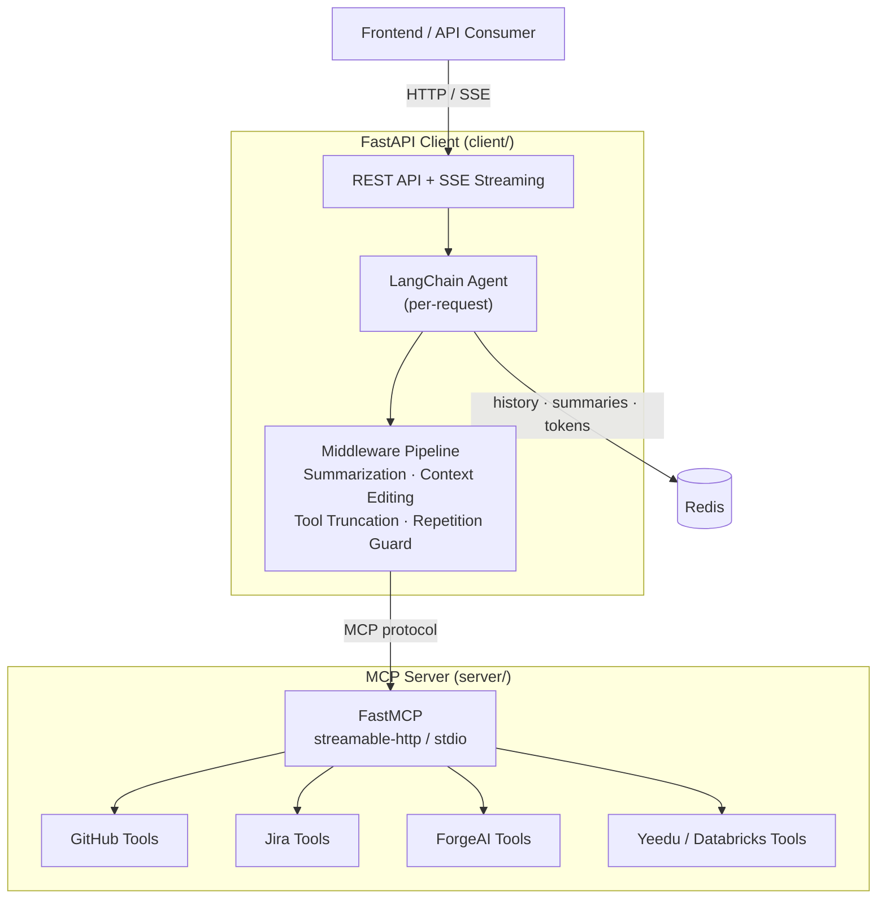

# ForgeAI MCP Server

An MCP (Model Context Protocol) server and FastAPI client for AI-driven data pipeline workflows. The server exposes tools for GitHub, Jira, ForgeAI, and execution engines (Yeedu / Databricks). The client orchestrates multi-stage LangChain agents that use those tools through streaming conversations.

## Architecture



| Component | Responsibility |
|-----------|---------------|
| **MCP Server** | Stateless tool host. Registers tools with `@mcp.tool()`, supports `streamable-http` and `stdio` transports. |
| **FastAPI Client** | Project-scoped conversations, stage-aware agent creation, SSE streaming, Redis persistence. |
| **Redis** | Conversation history, rolling summaries, cumulative token usage, conversation TTL. |
| **Middleware Pipeline** | Summarization, context editing, tool-result truncation, repetition guard, prompt caching. |

## Pipeline Stages

The client implements a multi-stage workflow for data pipeline development:

| Stage | Role | Focus |
|-------|------|-------|
| **Stage 1 -- Analyst** | Pipeline Specification | Analyze Jira tickets, discover data sources, produce a pipeline spec |
| **Stage 2 -- Data Engineer** | Implementation | Write Python/Spark code, deploy to Yeedu/Databricks, manage jobs |
| **Stage 3 -- Tester** | Validation | Monitor job execution, validate data quality, verify requirements |
| **Discovery** | Data Exploration | Browse sources, datasets, schemas, and entity relationships |

Each stage is a single LangChain agent configured with a stage-specific system prompt and a filtered tool set. Cross-stage handoff summaries are generated automatically when enabled.

## Quick Start

### Prerequisites

- Python 3.10+
- Redis
- At least one LLM API key (Anthropic, OpenAI, or other configured provider)
- Platform tokens for the tools you need (GitHub PAT, Jira token, Yeedu/Databricks credentials)

### Install

```bash
pip install -e .
```

> **The client hard-fails at startup unless a Signet daemon answers.**
> `MEMORY_ENABLED` defaults to `true`, and `MCPService.connect()` health-checks
> `SIGNET_DAEMON_HOOKS_URL` (default `http://127.0.0.1:3850`) and raises if it
> is unreachable. Either run the daemon (see `forgeai-context-server`) or set
> `MEMORY_ENABLED=false`. Following the steps below without doing one of those
> produces a client that crashes on `uvicorn client.app:app`.

### Configure

```bash
cp .env.example .env
```

Required variables:

```env
# LLM provider (at least one)
ANTHROPIC_API_KEY=sk-ant-...
OPENAI_API_KEY=sk-...

# MCP server endpoint
FORGEAI_MCP_SERVER_URL=http://localhost:8000/mcp

# Redis
FORGEAI_REDIS_URL=redis://localhost:6379

# Execution engine: "yeedu" or "databricks"
FORGEAI_EXECUTION_ENGINE=databricks
```

### Run Locally

```bash
# Terminal 1 -- MCP server
python server/main.py --transport streamable-http

# Terminal 2 -- FastAPI client
uvicorn client.app:app --port 8003
```

Verify:

```bash
curl http://localhost:8003/health
```

### Docker Compose (Full Stack)

```bash
docker-compose up -d
```

Starts MCP server, FastAPI client, Redis, and an Nginx HTTPS proxy. Configuration is read from `mcp.properties`.

To build and run the MCP server image standalone:

```bash
docker build -f server/Dockerfile -t forgeai-agents .
docker run --rm -p 8000:8000 forgeai-agents
```

## API Reference

### Endpoints

| Method | Path | Description |
|--------|------|-------------|
| `POST` | `/project/{project_id}/conversation/chat?stage=...` | Chat with a stage-specific agent (SSE) |
| `GET` | `/project/{project_id}/conversation/history?stage=...` | Get stage message history |
| `DELETE` | `/project/{project_id}/conversation?stage=...` | Delete stage conversation |
| `POST` | `/workstream/{id}/conversation/{cid}/chat` | Discovery chat (SSE) |
| `POST` | `/workstream/{id}/conversation/start` | Start a new discovery conversation |
| `GET` | `/workstream/{id}/conversation/{cid}/history` | Discovery conversation history |
| `DELETE` | `/workstream/{id}/conversation/{cid}` | Delete discovery conversation |
| `GET` | `/workstream/{id}/conversations` | List workstream conversations |
| `POST` | `/workstream/{id}/conversation/{cid}/rename` | Rename conversation |
| `POST` | `/workstream/{id}/conversation/{cid}/branch` | Branch from an assistant message |
| `GET` | `/health` | Health check (MCP, Redis, models, tools) |
| `GET` | `/models` | List available LLM models |

### Request Headers

Platform tokens are passed per-request and never stored:

| Header | Purpose |
|--------|---------|
| `Authorization: Bearer <token>` | Session auth |
| `X-GitHub-Token` | GitHub API access |
| `X-Jira-Token` | Jira API access |
| `X-Yeedu-Token` | Yeedu platform access |
| `X-ForgeAI-Token` | ForgeAI service access |
| `X-Databricks-*` | Databricks auth (`Auth-Type`, `Workspace-URL`, `Client-ID`, `Client-Secret`, `PAT-Token`) |

### Chat Request Body

```json
{
  "message": "Analyze PROJ-123 and create a pipeline specification",
  "model_name": "Claude Sonnet 4.6",
  "context": {
    "source_id": "project-alpha",
    "jira": { "jira_ticket": "PROJ-123", "jira_url": "https://jira.example.com/browse/PROJ-123" },
    "github_repos": ["org/repo"]
  }
}
```

### SSE Response Stream

```
data: {"type": "text_delta", "text": "Analyzing..."}
data: {"type": "tool_start", "tool_name": "jira_get_issue"}
data: {"type": "tool_result", "content": "..."}
data: {"type": "complete", "message_id": "...", "stopped_reason": {...}}
```

## Configuration

All settings are managed via environment variables (loaded from `.env`). Key groups:

| Group | Variables | Notes |
|-------|-----------|-------|
| LLM Providers | `ANTHROPIC_API_KEY`, `OPENAI_API_KEY`, `QWEN_API_KEY`, `NVIDIA_API_KEY` | At least one required |
| Gateway | `GATEWAY_PROVIDER` (`native` / `portkey` / `iliad`) | Optional routing layer |
| MCP Connection | `FORGEAI_MCP_SERVER_URL` | Server endpoint |
| Redis | `FORGEAI_REDIS_URL`, `FORGEAI_REDIS_NAMESPACE`, `CONVERSATION_TTL` | Session storage |
| Execution Engine | `FORGEAI_EXECUTION_ENGINE` (`databricks` / `yeedu`) | Selects tool set |
| Summarization | `SUMMARIZATION_ENABLED`, `SUMMARIZATION_TRIGGER_FRACTION`, `SUMMARIZATION_MODEL` | Rolling summary |
| Context Editing | `CONTEXT_EDITING_ENABLED`, `CONTEXT_EDITING_TRIGGER_FRACTION` | In-turn cleanup |
| Tool Truncation | `TOOL_RESULT_TRUNCATION_ENABLED`, `TOOL_RESULT_MAX_TOKENS` | Limits large results |
| Handoff | `HANDOFF_ENABLED`, `HANDOFF_MODEL` | Cross-stage summaries |
| Progressive Discovery | `PROGRESSIVE_DISCOVERY_ENABLED`, `PROGRESSIVE_DISCOVERY_THRESHOLD` | Lazy tool loading |
| SSL | `VERIFY_SSL`, `FORGEAI_YEEDU_SSL_CERT_PATH` | TLS configuration |

See [docs/configuration/settings-reference.md](docs/configuration/settings-reference.md) for the complete reference.

## Project Structure

```
forgeai-agents/
├── server/                          # MCP Server
│   ├── main.py                      # Entry point (transport selection)
│   ├── mcp_server.py                # FastMCP instance
│   ├── execution_engines.py         # Engine enum + conditional loading
│   ├── tools/                       # Tool implementations
│   │   ├── github/                  # GitHub tools
│   │   ├── jira/                    # Jira tools
│   │   ├── forgeai/                 # ForgeAI tools
│   │   ├── yeedu/                   # Yeedu tools
│   │   └── databricks/              # Databricks tools
│   └── clients/                     # HTTP clients for external APIs
├── client/                          # FastAPI Client
│   ├── app.py                       # FastAPI app + routes
│   ├── config.py                    # Settings, MODEL_REGISTRY, stage tool sets
│   ├── models.py                    # Pydantic request/response schemas
│   ├── storage.py                   # Redis storage service
│   ├── services/
│   │   ├── agent_service.py         # LangChain agent + middleware wiring
│   │   ├── mcp_service.py           # MCP client + token injection
│   │   ├── model_factory.py         # LLM instantiation per provider
│   │   ├── summarization.py         # Rolling summarization middleware
│   │   ├── handoff.py               # Cross-stage handoff logic
│   │   ├── progressive_discovery.py # Lazy tool schema loading
│   │   ├── tool_truncation.py       # Large result truncation
│   │   ├── summary_persistence.py   # Redis summary load/save
│   │   └── token_usage_tracker.py   # Per-request token accounting
│   └── utils/
│       ├── context_builders.py      # LLM context prompt assembly
│       └── prompt_utils.py          # Engine-aware prompt loading
├── docs/                            # Comprehensive documentation
├── docker-compose.yml               # Full-stack deployment
└── pyproject.toml                   # Dependencies & build config
```

## Documentation

The `docs/` directory contains detailed internal documentation:

- [Architecture Overview](docs/architecture/overview.md) -- component diagram, data flow, deployment
- [Middleware Pipeline](docs/architecture/middleware-pipeline.md) -- ordered middleware stack
- **Actors**: [Stage 1](docs/actors/stage-1-analyst.md) | [Stage 2](docs/actors/stage-2-data-engineer.md) | [Stage 3](docs/actors/stage-3-tester.md) | [Discovery](docs/actors/discovery.md)
- **Workflows**: [Chat Lifecycle](docs/workflows/chat-lifecycle.md) | [Tool Invocation](docs/workflows/tool-invocation.md) | [Summarization](docs/workflows/summarization.md) | [Progressive Discovery](docs/workflows/progressive-discovery.md) | [Cross-Stage Handoff](docs/workflows/cross-stage-handoff.md) | [Context Management](docs/workflows/context-management.md)
- **Configuration**: [Settings Reference](docs/configuration/settings-reference.md) | [Model Registry](docs/configuration/model-registry.md) | [Execution Engines](docs/configuration/execution-engines.md)

## License

Proprietary -- Copyright (c) 2024 Modak Analytics. All rights reserved. See [LICENSE](LICENSE).
